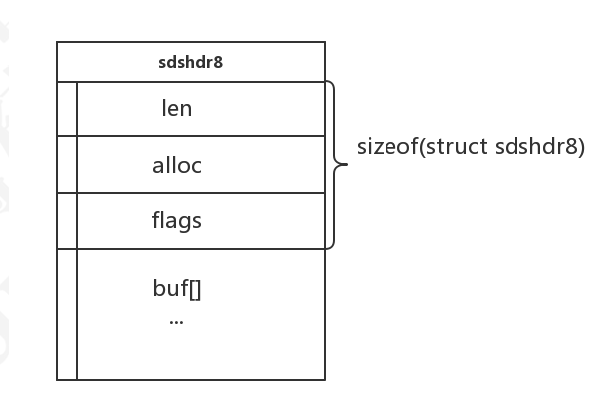
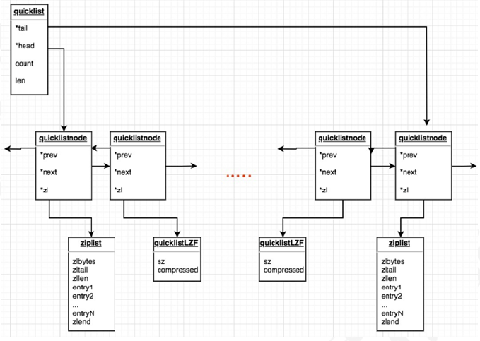

缓存大致可以分为两类，一种是应用内缓存，比如Map(简单的数据结构)，以及EH Cache(Java第三方库)，另一种就是缓存组件，比如Memached，Redis；Redis（remote dictionary server）是一个基于KEY-VALUE的高性能的存储系统，通过提供多种键值数据类型来适应不同场景下的缓存与存储需求它以字典结构存储数据，并允许其他应用通过TCP协议读写字典中的内容。数据结构如下

## 数据结构

字符串类型
字符串类型是redis中最基本的数据类型，它能存储任何形式的字符串，包括二进制数据。你可以用它存储用户的
邮箱、json化的对象甚至是图片。一个字符类型键允许存储的最大容量是512M

在Redis内部，String类型通过 int、SDS(simple dynamic string)作为结构存储，int用来存放整型数据，sds存放字
节/字符串和浮点型数据。在C的标准字符串结构下进行了封装，用来提升基本操作的性能，同时也充分利用已有的
C的标准库，简化实现逻辑。我们可以在redis的源码中(sds.h)中看到sds的结构如下；

```c
typedef char *sds;
```

redis3.2分支引入了五种sdshdr类型，目的是为了满足不同长度字符串可以使用不同大小的Header，从而节省内
存，每次在创建一个sds时根据sds的实际长度判断应该选择什么类型的sdshdr，不同类型的sdshdr占用的内存空
间不同。这样细分一下可以省去很多不必要的内存开销，下面是3.2的sdshdr定义

```c
/* Note: sdshdr5 is never used, we just access the flags byte directly.
 * However is here to document the layout of type 5 SDS strings. */
struct __attribute__ ((__packed__)) sdshdr5 {
    unsigned char flags; /* 3 lsb of type, and 5 msb of string length */
    char buf[];
};
struct __attribute__ ((__packed__)) sdshdr8 {
    uint8_t len; /* used */
    uint8_t alloc; /* excluding the header and null terminator */
    unsigned char flags; /* 3 lsb of type, 5 unused bits */
    char buf[];
};
struct __attribute__ ((__packed__)) sdshdr16 {
    uint16_t len; /* used */
    uint16_t alloc; /* excluding the header and null terminator */
    unsigned char flags; /* 3 lsb of type, 5 unused bits */
    char buf[];
};
struct __attribute__ ((__packed__)) sdshdr32 {
    uint32_t len; /* used */
    uint32_t alloc; /* excluding the header and null terminator */
    unsigned char flags; /* 3 lsb of type, 5 unused bits */
    char buf[];
};
struct __attribute__ ((__packed__)) sdshdr64 {
    uint64_t len; /* used */
    uint64_t alloc; /* excluding the header and null terminator */
    unsigned char flags; /* 3 lsb of type, 5 unused bits */
    char buf[];
};
```

sdshdr8的内存布局



列表类型

列表类型(list)可以存储一个有序的字符串列表，常用的操作是向列表两端添加元素或者获得列表的某一个片段。

列表类型内部使用双向链表实现，所以向列表两端添加元素的时间复杂度为O(1), 获取越接近两端的元素速度就越
快。这意味着即使是一个有几千万个元素的列表，获取头部或尾部的10条记录也是很快的

内部数据结构
redis3.2之前，List类型的value对象内部以linkedlist或者ziplist来实现, 当list的元素个数和单个元素的长度比较小
的时候，Redis会采用ziplist（压缩列表）来实现来减少内存占用。否则就会采用linkedlist（双向链表）结构。
redis3.2之后，采用的一种叫quicklist的数据结构来存储list，列表的底层都由quicklist实现。
这两种存储方式都有优缺点，双向链表在链表两端进行push和pop操作，在插入节点上复杂度比较低，但是内存开
销比较大； ziplist存储在一段连续的内存上，所以存储效率很高，但是插入和删除都需要频繁申请和释放内存；
quicklist仍然是一个双向链表，只是列表的每个节点都是一个ziplist，其实就是linkedlist和ziplist的结合，quicklist
中每个节点ziplist都能够存储多个数据元素，在源码中的文件为【quicklist.c】，在源码第一行中有解释为：A
doubly linked list of ziplists意思为一个由ziplist组成的双向链表；



